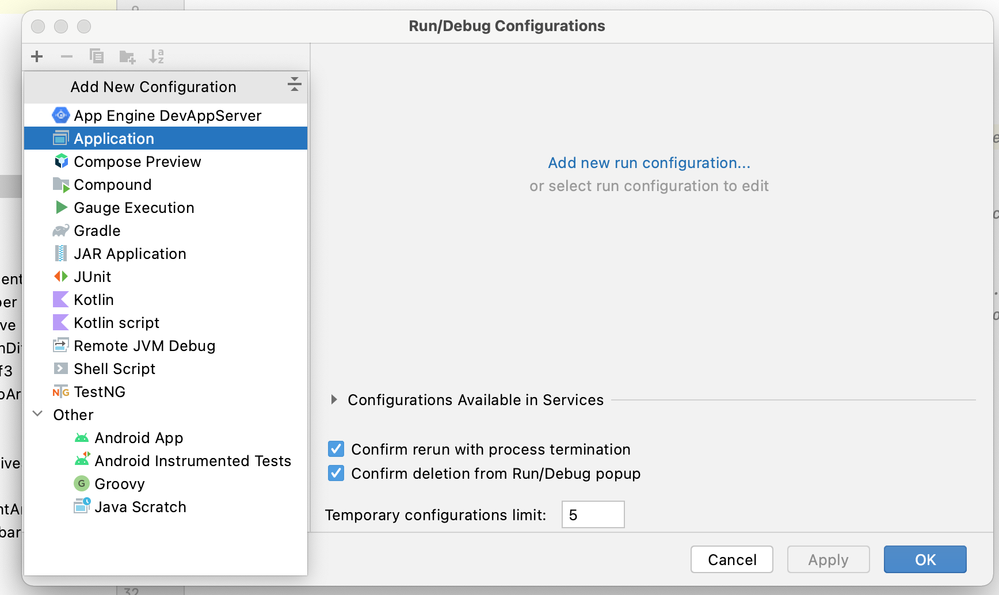
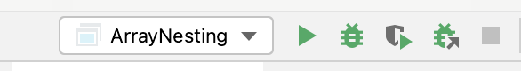

# Leetcode-InterviewBit-Practice-Problems
A project containing my solution for Leetcode, InterviewBit problems along with DSA Practice problems.

## Build and run

To run the project and source files:

Clone the repo -> Open Android Studio -> Select File -> Open the Repository folder.

The project is configured to run single `Java` & `Kotlin` files from Android Studio.

After Importing the project to Android Studio:

1. Click Add Configuration

2. Select plus icon at top left and create an Application.

3. Leave it as unnamed and click apply and ok.

4. Now you can go to `src\main\javaclasses` or `src\main\kotlinclasses` folder and run/debug single Java/Kotlin class from Android studio.

## Add Custom Library

You can add custom library and sources into the `lib` folder and use it in your class.